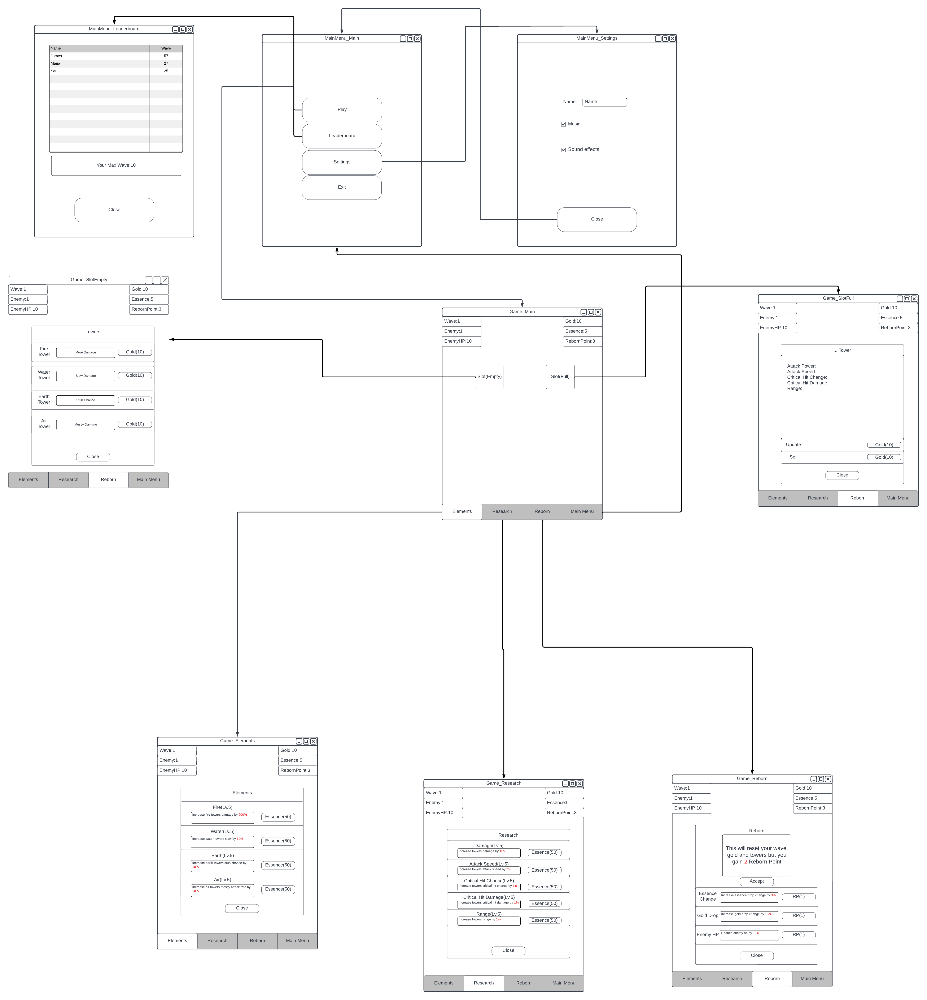
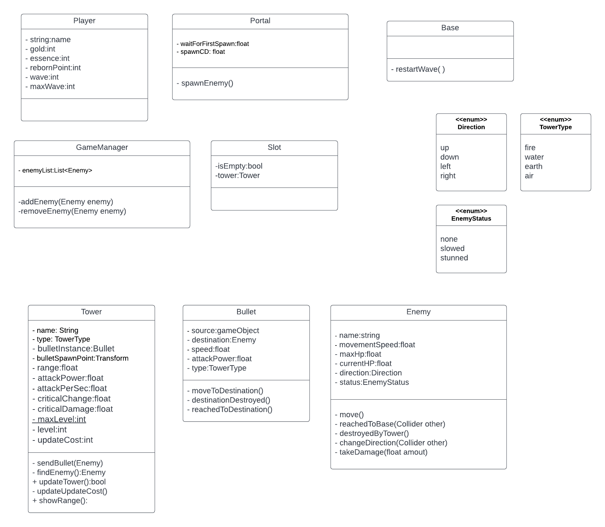

# Progress Report

#### 1)Introduction

+ This project is a tower defence game named Elemental Defense. It targets Android Platform.
In short, we protect our base from enemies with towers. We can buy towers and update them
with resources. We have 3 resource. They are gold, essence and reborn point. We gain gold
from all the enemies we destroy, and these enemies drop essence with a certain chance. We
can reset the game after the 50th wave and this way we will gain reborn points.

#### 2)Current Progress

> ##### 2-1)Completed

>> ###### 2-1-1)UI Sketch

>>

>> ###### 2-1-2)Class Diagram

>>
	
>> ###### 2-1-3)Basic Codes

>>+ I wrote some basic codes for project. Firtly, I wrote a screen manager to control
			UI. I wrote a sound manager to control music and sound effects. I wrote Enemy class,
			it doesn't have all the targeted features, but it has basic features such as
			path tracking, taking damage. I wrote Tower class, it doesn't have all of the targeted
			features, but it has basic features such as finding an enemy and sending bullets to
			the enemy.

> ##### 2-2)Challenges

>> ###### 2-2-1)Enemy AI

>>+ In order for the enemies to follow the path correctly, I first tried Unity's path tracking
			components (NavMesh), but I could not get the results I wanted because in this game, the
			enemies need to move in a certain order. I looked at other solutions but decided that they
			would be too costly and I developed a simpler and adequate solution for this game. I added
			triggers to the places where the enemies need to change direction, and when the enemies reach
			these triggers, they change movement direction to the specified direction.

>> ###### 2-2-2)Establishing a Balanced Game
>>+ There are a lot of variables in this project and these variables are constantly changing,
			it is necessary to balance these variables for a reasonable gaming experience.
